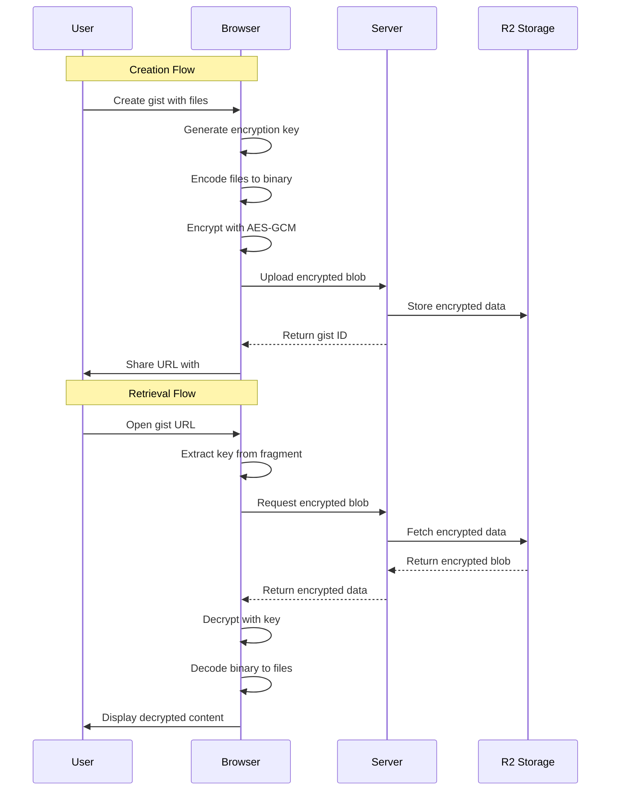

# 🔐 GhostPaste Encryption Architecture

## Table of Contents

- [Overview](#overview)
- [Architecture](#architecture)
- [Security Model](#security-model)
- [Implementation Details](#implementation-details)
- [Usage Guide](#usage-guide)
- [Security Best Practices](#security-best-practices)
- [Threat Model](#threat-model)
- [Cryptographic Specifications](#cryptographic-specifications)
- [Key Management](#key-management)
- [Testing](#testing)

## Overview

GhostPaste implements zero-knowledge client-side encryption to ensure that gists are encrypted before leaving the user's browser and can only be decrypted by someone with the encryption key. The server (and Cloudflare) never has access to the plaintext content or encryption keys.

### Key Principles

1. **Zero-Knowledge**: The server never sees unencrypted content or encryption keys
2. **Client-Side Only**: All encryption/decryption happens in the browser
3. **URL Fragment Keys**: Encryption keys are shared via URL fragments (never sent to server)
4. **Forward Secrecy**: Each gist uses a unique encryption key
5. **Standard Algorithms**: Uses Web Crypto API with AES-256-GCM

## Architecture

### High-Level Flow



### Component Architecture

```
┌─────────────────┐     ┌──────────────────┐     ┌─────────────────┐
│   Frontend UI   │────▶│ Crypto Utilities │────▶│  Web Crypto API │
└─────────────────┘     └──────────────────┘     └─────────────────┘
         │                       │
         │                       ▼
         │              ┌──────────────────┐
         │              │  Binary Format   │
         │              └──────────────────┘
         │                       │
         ▼                       ▼
┌─────────────────┐     ┌──────────────────┐
│   API Routes    │────▶│   R2 Storage     │
└─────────────────┘     └──────────────────┘
```

## Security Model

### Trust Boundaries

1. **Client (Trusted)**

   - Browser environment
   - User's device
   - JavaScript execution context

2. **Network (Untrusted)**

   - HTTPS connection
   - Cloudflare edge

3. **Server (Untrusted)**
   - Cloudflare Workers
   - R2 storage
   - Server logs

### Security Properties

1. **Confidentiality**: Content is encrypted with AES-256-GCM
2. **Integrity**: GCM mode provides authenticated encryption
3. **Authenticity**: Optional PIN protection for edit access
4. **Forward Secrecy**: Each gist has a unique key
5. **Key Independence**: Compromising one key doesn't affect others

## Implementation Details

### File Structure

```
lib/
├── crypto.ts          # Core encryption/decryption functions
├── crypto-utils.ts    # High-level encryption utilities
├── binary.ts          # Binary encoding/decoding
├── auth.ts            # PIN authentication (PBKDF2)
├── base64.ts          # Base64 encoding utilities
└── id.ts              # Secure ID generation
```

### Encryption Process

1. **File Preparation**

   ```typescript
   // Files are encoded to a binary format
   const encodedData = encodeFiles(files);
   ```

2. **Key Generation**

   ```typescript
   // Generate a 256-bit AES key
   const key = await crypto.subtle.generateKey(
     { name: "AES-GCM", length: 256 },
     true, // extractable
     ["encrypt", "decrypt"]
   );
   ```

3. **Encryption**

   ```typescript
   // Encrypt with a random IV
   const iv = crypto.getRandomValues(new Uint8Array(12));
   const ciphertext = await crypto.subtle.encrypt(
     { name: "AES-GCM", iv, tagLength: 128 },
     key,
     encodedData
   );
   ```

4. **Storage Format**
   ```
   [12 bytes IV][Encrypted Data with Auth Tag]
   ```

### Decryption Process

1. **Key Extraction**

   ```typescript
   // Extract key from URL fragment
   const key = await extractKeyFromUrl(window.location.href);
   ```

2. **Data Retrieval**

   ```typescript
   // Fetch encrypted blob from server
   const encryptedBlob = await fetchFromR2(gistId);
   ```

3. **Decryption**

   ```typescript
   // Unpack IV and decrypt
   const { iv, ciphertext } = unpackEncryptedBlob(encryptedBlob);
   const plaintext = await crypto.subtle.decrypt(
     { name: "AES-GCM", iv, tagLength: 128 },
     key,
     ciphertext
   );
   ```

4. **File Reconstruction**
   ```typescript
   // Decode binary format back to files
   const files = decodeFiles(plaintext);
   ```

### Binary Format

The binary format efficiently encodes multiple files:

```
Header (12 bytes):
├─ Magic bytes (4): "GHST"
├─ Version (2): 0x0001
├─ File count (2): uint16
└─ Reserved (4): 0x00000000

For each file:
├─ Name length (2): uint16
├─ Name (variable): UTF-8 string
├─ Content length (4): uint32
├─ Content (variable): UTF-8 string
└─ Language length + data (variable): Optional
```

### PIN Protection

Edit PINs use PBKDF2-SHA256 for secure hashing:

```typescript
const salt = crypto.getRandomValues(new Uint8Array(16));
const keyMaterial = await crypto.subtle.importKey(
  "raw",
  encoder.encode(pin),
  { name: "PBKDF2" },
  false,
  ["deriveBits"]
);
const hash = await crypto.subtle.deriveBits(
  {
    name: "PBKDF2",
    salt: salt,
    iterations: 100000,
    hash: "SHA-256",
  },
  keyMaterial,
  256
);
```

## Usage Guide

### Creating an Encrypted Gist

```typescript
import { createGist } from "@/lib/crypto-utils";

const files = [
  { name: "main.js", content: 'console.log("Hello");', language: "javascript" },
  { name: "README.md", content: "# My Project", language: "markdown" },
];

const { gist, shareUrl } = await createGist(files, {
  description: "My secure code",
  editPin: "MySecurePin123",
  oneTimeView: false,
  expiresAt: new Date(Date.now() + 86400000), // 24 hours
});

// Share this URL - the key is in the fragment
console.log(shareUrl); // https://ghostpaste.dev/g/abc123#key=...
```

### Loading and Decrypting a Gist

```typescript
import { loadGistFromUrl } from "@/lib/crypto-utils";

// The URL contains the encryption key in the fragment
const url = "https://ghostpaste.dev/g/abc123#key=...";

// Fetch encrypted data from server
const encryptedData = await fetchGistData("abc123");
const metadata = await fetchGistMetadata("abc123");

// Decrypt the gist
const decryptedGist = await loadGistFromUrl(url, encryptedData, metadata);

if (decryptedGist) {
  console.log(decryptedGist.files); // Array of decrypted files
}
```

### Low-Level Encryption API

```typescript
import { generateEncryptionKey, encrypt, decrypt } from "@/lib/crypto";

// Generate key
const key = await generateEncryptionKey();

// Encrypt data
const data = new TextEncoder().encode("Secret message");
const encrypted = await encrypt(data, key);

// Decrypt data
const decrypted = await decrypt(encrypted, key);
const message = new TextDecoder().decode(decrypted);
```

## Security Best Practices

### For Developers

1. **Never Log Keys**: Never log, store, or transmit encryption keys to the server

   ```typescript
   // ❌ BAD
   console.log("Encryption key:", key);
   await fetch("/api/save-key", { body: key });

   // ✅ GOOD
   // Keys stay in browser memory only
   ```

2. **Use URL Fragments**: Always use fragments for key sharing

   ```typescript
   // ❌ BAD - Query parameters are sent to server
   const url = `https://ghostpaste.dev/g/${id}?key=${key}`;

   // ✅ GOOD - Fragments are never sent to server
   const url = `https://ghostpaste.dev/g/${id}#key=${key}`;
   ```

3. **Validate Everything**: Always validate decrypted data

   ```typescript
   try {
     const decrypted = await decrypt(data, key);
     const files = decodeFiles(decrypted);
     // Validate file structure
     if (!Array.isArray(files) || files.length === 0) {
       throw new Error("Invalid decrypted data");
     }
   } catch (error) {
     // Handle gracefully
   }
   ```

4. **Use Secure Random**: Always use crypto.getRandomValues()

   ```typescript
   // ❌ BAD
   const iv = new Uint8Array(12);
   for (let i = 0; i < 12; i++) {
     iv[i] = Math.floor(Math.random() * 256);
   }

   // ✅ GOOD
   const iv = crypto.getRandomValues(new Uint8Array(12));
   ```

5. **Handle Errors Securely**: Don't leak information in errors

   ```typescript
   // ❌ BAD
   throw new Error(`Decryption failed: ${key} is invalid`);

   // ✅ GOOD
   throw new Error("Invalid decryption key");
   ```

### For Users

1. **Share URLs Securely**: Use secure channels for sharing URLs
2. **Use Strong PINs**: If using PIN protection, choose strong PINs
3. **Understand Expiration**: One-time view and expiring gists cannot be recovered
4. **Save Important Keys**: Keep backups of encryption keys for important gists
5. **Verify URLs**: Ensure you're on the correct domain before entering sensitive data

## Threat Model

### In Scope Threats

1. **Passive Network Attackers**

   - Threat: Eavesdropping on network traffic
   - Mitigation: HTTPS + client-side encryption

2. **Compromised Server**

   - Threat: Malicious server trying to steal data
   - Mitigation: Zero-knowledge architecture, keys never sent to server

3. **CDN/Edge Compromise**

   - Threat: Cloudflare compromise
   - Mitigation: End-to-end encryption, encrypted data only

4. **Storage Breach**

   - Threat: R2 storage compromise
   - Mitigation: Data encrypted at rest with user keys

5. **URL Sharing Attacks**
   - Threat: URLs intercepted during sharing
   - Mitigation: Optional PIN protection, expiring links

### Out of Scope Threats

1. **Compromised Client**

   - If the user's browser is compromised, encryption cannot help
   - Users should ensure their devices are secure

2. **Malicious JavaScript**

   - Supply chain attacks on dependencies
   - Mitigated by SRI, CSP, and regular audits

3. **Browser Vulnerabilities**

   - Zero-days in browser crypto implementations
   - Users should keep browsers updated

4. **Physical Access**

   - Shoulder surfing, device theft
   - Users should practice physical security

5. **Social Engineering**
   - Tricking users into revealing URLs/PINs
   - User education is key

### Attack Scenarios and Mitigations

1. **Scenario**: Attacker gains access to R2 storage

   - **Impact**: Encrypted blobs exposed
   - **Mitigation**: Without keys, data remains encrypted

2. **Scenario**: Man-in-the-middle attack

   - **Impact**: Could see encrypted traffic
   - **Mitigation**: HTTPS + encryption provides defense in depth

3. **Scenario**: Server-side code injection

   - **Impact**: Could modify served JavaScript
   - **Mitigation**: CSP, SRI, regular security audits

4. **Scenario**: Brute force attack on gist IDs
   - **Impact**: Could find valid gist IDs
   - **Mitigation**: Rate limiting, longer IDs, expiring gists

## Cryptographic Specifications

### Algorithms

- **Encryption**: AES-256-GCM

  - Key size: 256 bits
  - IV size: 96 bits (12 bytes)
  - Tag size: 128 bits
  - Mode: Galois/Counter Mode (authenticated encryption)

- **Key Derivation**: PBKDF2-SHA256

  - Iterations: 100,000
  - Salt size: 128 bits (16 bytes)
  - Output: 256 bits

- **Hashing**: SHA-256

  - Used for integrity checks
  - Part of PBKDF2 for PIN hashing

- **Random Generation**: Web Crypto getRandomValues()
  - Cryptographically secure
  - Used for IVs, salts, and IDs

### Key Formats

- **Storage**: Base64url encoding (no padding)
- **Transport**: URL fragment parameters
- **Internal**: CryptoKey objects (non-extractable in production)

### Security Parameters

```typescript
// Encryption parameters
const ALGORITHM = "AES-GCM";
const KEY_LENGTH = 256; // bits
const IV_LENGTH = 12; // bytes
const TAG_LENGTH = 128; // bits

// PBKDF2 parameters
const PBKDF2_ITERATIONS = 100_000;
const PBKDF2_SALT_LENGTH = 16; // bytes
const PBKDF2_KEY_LENGTH = 32; // bytes

// ID generation
const GIST_ID_LENGTH = 8; // characters
const GIST_ID_ALPHABET = "0-9a-zA-Z"; // 62 chars = ~48 bits entropy
```

## Key Management

### Key Generation

```typescript
// Each gist gets a unique key
const key = await crypto.subtle.generateKey(
  { name: "AES-GCM", length: 256 },
  true, // extractable for sharing
  ["encrypt", "decrypt"]
);
```

### Key Distribution

```typescript
// Keys are shared via URL fragments
const exportedKey = await crypto.subtle.exportKey("raw", key);
const keyString = base64UrlEncode(new Uint8Array(exportedKey));
const shareUrl = `${baseUrl}/g/${gistId}#key=${keyString}`;
```

### Key Storage

- **Browser**: Keys exist only in memory during encryption/decryption
- **Server**: Never sees or stores keys
- **User**: Responsible for saving/sharing URLs with keys

### Key Rotation

- Not applicable - each gist has its own key
- No key reuse between gists
- No master keys or key hierarchies

## Testing

### Unit Tests

```typescript
// Test encryption/decryption cycle
it("should encrypt and decrypt data correctly", async () => {
  const key = await generateEncryptionKey();
  const plaintext = new TextEncoder().encode("Hello, World!");

  const encrypted = await encrypt(plaintext, key);
  const decrypted = await decrypt(encrypted, key);

  expect(decrypted).toEqual(plaintext);
});

// Test key extraction from URLs
it("should extract key from URL fragment", async () => {
  const originalKey = await generateEncryptionKey();
  const url = await generateShareableUrl(
    "https://example.com",
    "id",
    originalKey
  );

  const extractedKey = await extractKeyFromUrl(url);
  expect(extractedKey).toBeTruthy();

  // Verify keys are equivalent by encrypting/decrypting
  const data = new TextEncoder().encode("test");
  const encrypted = await encrypt(data, originalKey);
  const decrypted = await decrypt(encrypted, extractedKey!);
  expect(decrypted).toEqual(data);
});
```

### Integration Tests

```typescript
// Test full gist lifecycle
it("should handle complete gist lifecycle", async () => {
  // Create
  const files = [{ name: "test.js", content: "test", language: "javascript" }];
  const { gist, shareUrl } = await createGist(files, { editPin: "Pin123" });

  // Validate
  const isValid = await validateGistPin("Pin123", gist.metadata);
  expect(isValid).toBe(true);

  // Load
  const loaded = await loadGistFromUrl(
    shareUrl,
    gist.encryptedData,
    gist.metadata
  );
  expect(loaded?.files).toEqual(files);
});
```

### Security Tests

```typescript
// Test against known attacks
it("should fail with tampered ciphertext", async () => {
  const key = await generateEncryptionKey();
  const encrypted = await encrypt(data, key);

  // Tamper with ciphertext
  encrypted.ciphertext[0] ^= 0xff;

  await expect(decrypt(encrypted, key)).rejects.toThrow();
});

// Test key independence
it("should not decrypt with different key", async () => {
  const key1 = await generateEncryptionKey();
  const key2 = await generateEncryptionKey();

  const encrypted = await encrypt(data, key1);
  await expect(decrypt(encrypted, key2)).rejects.toThrow();
});
```

### Performance Tests

```typescript
// Test encryption performance
it("should handle large files efficiently", async () => {
  const largeFile = new Uint8Array(5 * 1024 * 1024); // 5MB
  crypto.getRandomValues(largeFile);

  const start = performance.now();
  const key = await generateEncryptionKey();
  const encrypted = await encrypt(largeFile, key);
  const end = performance.now();

  expect(end - start).toBeLessThan(1000); // Under 1 second
});
```

## Compliance and Standards

### Standards Compliance

- **NIST SP 800-38D**: AES-GCM implementation
- **NIST SP 800-132**: PBKDF2 for password-based derivation
- **RFC 4648**: Base64url encoding
- **Web Crypto API**: W3C standard for browser cryptography

### Security Headers

```typescript
// Recommended security headers
{
  'Content-Security-Policy': "default-src 'self'; script-src 'self' 'unsafe-inline'; style-src 'self' 'unsafe-inline';",
  'X-Content-Type-Options': 'nosniff',
  'X-Frame-Options': 'DENY',
  'X-XSS-Protection': '1; mode=block',
  'Referrer-Policy': 'no-referrer',
  'Permissions-Policy': 'geolocation=(), microphone=(), camera=()'
}
```

### Future Considerations

1. **Post-Quantum**: Monitor NIST PQC standardization
2. **Key Escrow**: Intentionally not implemented (zero-knowledge)
3. **Compliance**: GDPR right-to-deletion via expiring gists
4. **Auditing**: Regular third-party security audits recommended

---

_This document is part of the GhostPaste security documentation. For implementation details, see the source code in `/lib/crypto_`.\*
