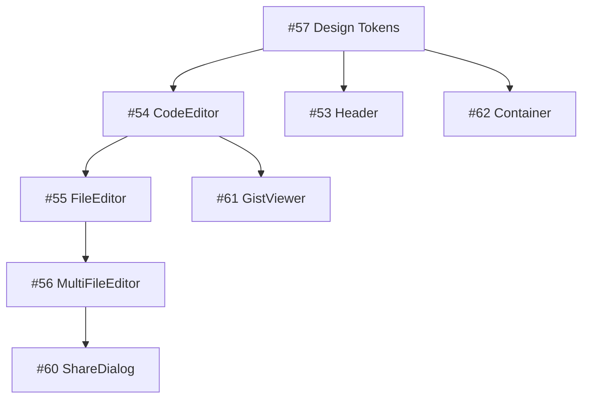

# Phase 4: UI Components - Implementation Summary

## Overview

Phase 4 consists of 19 GitHub issues to implement all UI components for GhostPaste. The components are grouped into 5 categories and should be implemented in a specific order to manage dependencies.

## Issue Summary

### Priority Distribution

- **Critical** (3): Core editor components that block other features
- **High** (5): Essential components for basic functionality
- **Medium** (8): Important but not blocking components
- **Low** (3): Nice-to-have enhancements

### Time Estimates

- **Total Phase Duration**: 3-4 weeks
- **Critical Path**: 1-2 weeks (Editor components)
- **Parallel Work**: Multiple developers can work on different groups

## Implementation Phases

### Week 1: Foundation & Core Editor

**Must complete first** (blocking other work):

1. #57: Design tokens (2-4 hours)
2. #54: CodeEditor component (8-12 hours)
3. #55: FileEditor component (4-6 hours)
4. #56: MultiFileEditor component (6-8 hours)

**Can start in parallel**:

- #53: Header component (4-6 hours)
- #62: Container component (2-3 hours)

### Week 2: Display & Form Components

**Primary work**:

- #61: GistViewer component (6-8 hours)
- #60: ShareDialog component (4-6 hours)
- #64: ExpirySelector component (3-4 hours)
- #65: PINInput component (4-6 hours)

**Support work**:

- #67: LoadingStates component (4-6 hours)
- #58: ErrorBoundary component (3-4 hours)
- #63: AddFileButton component (2-3 hours)

### Week 3: Enhancements & Polish

**UI Features**:

- #68: Toast notifications (4-6 hours)
- #59: Copy to clipboard (3-4 hours)
- #66: FileList component (4-6 hours)

**Lower priority**:

- #72: Keyboard shortcuts (4-6 hours)
- #71: VersionHistory component (3-4 hours)
- #70: Footer component (2-3 hours)

## Key Dependencies



## Technical Considerations

### 1. Component Library Setup

Before starting, ensure:

- shadcn/ui is properly configured
- Theme provider is set up
- Tailwind CSS is configured with custom design tokens

### 2. CodeMirror Integration

The CodeEditor component (#54) is the most complex:

- Requires careful memory management
- Must handle theme switching
- Needs performance optimization for large files
- Should support all installed language modes

### 3. State Management

MultiFileEditor (#56) needs efficient state management:

- Consider using `useReducer` for complex state
- Implement proper memoization
- Handle file array updates immutably

### 4. Accessibility Requirements

Every component must:

- Support keyboard navigation
- Include proper ARIA labels
- Work with screen readers
- Meet WCAG 2.1 AA standards

### 5. Testing Strategy

For each component:

- Unit tests for logic
- Integration tests for user interactions
- Accessibility tests
- Visual regression tests (optional)

## Success Criteria

### Phase Completion

- [ ] All 19 issues completed and merged
- [ ] Components documented with examples
- [ ] Test coverage >80%
- [ ] No accessibility violations
- [ ] Performance benchmarks met

### Quality Gates

1. **Code Review**: Every PR reviewed by at least one person
2. **Testing**: All tests passing including new tests
3. **Documentation**: Props and usage documented
4. **Accessibility**: Tested with keyboard and screen reader
5. **Performance**: Renders within 50ms

## Resource Allocation

### Recommended Team Structure

- **Lead Developer**: Focus on critical path (editor components)
- **UI Developer**: Work on form and display components
- **Junior Developer**: Handle layout components and simple features

### Parallel Work Opportunities

Multiple developers can work simultaneously on:

- Layout components (Header, Footer, Container)
- Form components (ExpirySelector, PINInput)
- UI features (Toast, Copy to clipboard)

## Risk Mitigation

### Technical Risks

1. **CodeMirror Complexity**: Allocate extra time, have fallback plan
2. **Performance Issues**: Profile early, optimize as needed
3. **State Management**: Design state structure carefully upfront

### Schedule Risks

1. **Dependencies**: Start critical path items first
2. **Integration Issues**: Plan integration testing time
3. **Design Changes**: Get design approval before implementation

## Next Steps

1. **Create all GitHub issues** using the templates in PHASE_4_ISSUES.md
2. **Assign priorities and labels** according to the breakdown
3. **Set up project board** to track progress
4. **Begin with critical path** components
5. **Schedule design review** for completed components

## Useful Commands

```bash
# Create issues using GitHub CLI
gh issue create --title "feat: create header component with navigation" \
  --body "$(cat issue_template.md)" \
  --label "ui,component,priority: high" \
  --project "👻 GhostPaste"

# List all Phase 4 issues
gh issue list --label "ui" --project "👻 GhostPaste"

# Create PR with proper labels
gh pr create --title "feat: implement CodeEditor component" \
  --label "ui,component" \
  --project "👻 GhostPaste"
```
