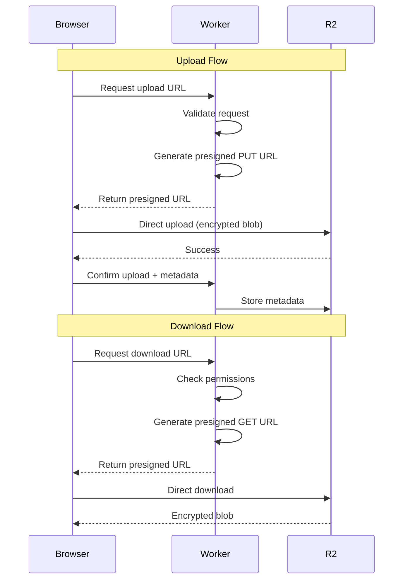
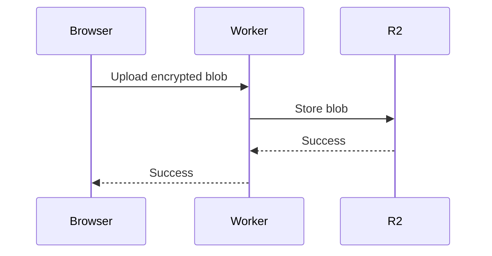

# 🚀 R2 Direct Access Architecture

## Overview

Direct browser-to-R2 access using presigned URLs can significantly improve performance by:

- Reducing latency (direct to Cloudflare edge)
- Lowering server costs (no Worker CPU time for transfers)
- Improving scalability (offload bandwidth to Cloudflare)
- Enabling larger file uploads (bypass Worker limits)

## Architecture Options

### Option 1: Presigned URLs (Recommended for GhostPaste)



### Option 2: Worker Proxy (Current Approach)



## Implementation Guide

### 1. Worker Endpoint for Presigned URLs

```typescript
// app/api/upload/route.ts
import { PutObjectCommand, GetObjectCommand } from "@aws-sdk/client-s3";
import { getSignedUrl } from "@aws-sdk/s3-request-presigner";

export async function POST(request: Request) {
  const { fileSize, gistId } = await request.json();

  // Validate request
  if (fileSize > MAX_FILE_SIZE) {
    return Response.json({ error: "File too large" }, { status: 413 });
  }

  // Create S3 client for R2
  const s3Client = new S3Client({
    region: "auto",
    endpoint: `https://${env.ACCOUNT_ID}.r2.cloudflarestorage.com`,
    credentials: {
      accessKeyId: env.R2_ACCESS_KEY_ID,
      secretAccessKey: env.R2_SECRET_ACCESS_KEY,
    },
  });

  // Generate presigned PUT URL
  const command = new PutObjectCommand({
    Bucket: env.R2_BUCKET_NAME,
    Key: `gists/${gistId}/encrypted.bin`,
    ContentType: "application/octet-stream",
    ContentLength: fileSize,
  });

  const uploadUrl = await getSignedUrl(s3Client, command, {
    expiresIn: 3600, // 1 hour
  });

  return Response.json({ uploadUrl, gistId });
}
```

### 2. Browser Upload Implementation

```typescript
// lib/r2-direct.ts
export async function uploadDirectToR2(
  encryptedBlob: Uint8Array,
  gistId: string
): Promise<void> {
  // Step 1: Get presigned URL from Worker
  const response = await fetch("/api/upload", {
    method: "POST",
    headers: { "Content-Type": "application/json" },
    body: JSON.stringify({
      fileSize: encryptedBlob.length,
      gistId,
    }),
  });

  if (!response.ok) {
    throw new Error("Failed to get upload URL");
  }

  const { uploadUrl } = await response.json();

  // Step 2: Upload directly to R2
  const uploadResponse = await fetch(uploadUrl, {
    method: "PUT",
    body: encryptedBlob,
    headers: {
      "Content-Type": "application/octet-stream",
      "Content-Length": encryptedBlob.length.toString(),
    },
  });

  if (!uploadResponse.ok) {
    throw new Error("Failed to upload to R2");
  }

  // Step 3: Confirm upload and save metadata
  await fetch(`/api/gists/${gistId}/confirm`, {
    method: "POST",
    headers: { "Content-Type": "application/json" },
    body: JSON.stringify({ uploaded: true }),
  });
}
```

### 3. CORS Configuration

```typescript
// Worker to configure CORS for R2 bucket
export async function configureCORS() {
  const corsRules = [
    {
      AllowedOrigins: [
        "https://ghostpaste.dev",
        "http://localhost:3000", // Dev only
      ],
      AllowedMethods: ["GET", "PUT", "HEAD"],
      AllowedHeaders: ["Content-Type", "Content-Length"],
      ExposeHeaders: ["ETag"],
      MaxAgeSeconds: 3600,
    },
  ];

  // Apply CORS configuration via R2 API
  await r2.putBucketCors({
    Bucket: BUCKET_NAME,
    CORSConfiguration: { CORSRules: corsRules },
  });
}
```

## Security Considerations

### 1. Presigned URL Security

```typescript
// Secure presigned URL generation
export async function generateSecurePresignedUrl(
  gistId: string,
  operation: "PUT" | "GET"
): Promise<string> {
  // Add security headers
  const metadata = {
    "x-amz-server-side-encryption": "AES256",
    "x-amz-meta-gist-id": gistId,
    "x-amz-meta-timestamp": Date.now().toString(),
  };

  // Short expiration for security
  const expiresIn = operation === "PUT" ? 300 : 3600; // 5 min for upload, 1 hour for download

  // Include IP restriction if needed
  const conditions = [
    ["content-length-range", 0, MAX_FILE_SIZE],
    ["starts-with", "$Content-Type", "application/octet-stream"],
  ];

  return getSignedUrl(s3Client, command, {
    expiresIn,
    signableHeaders: new Set(["host"]),
    signingRegion: "auto",
  });
}
```

### 2. Access Control

```typescript
// Validate access before generating URLs
export async function validateAccess(
  request: Request,
  gistId: string
): Promise<boolean> {
  // Check rate limits
  const ip = request.headers.get("CF-Connecting-IP");
  if (await isRateLimited(ip)) {
    return false;
  }

  // Verify gist exists and check permissions
  const metadata = await getGistMetadata(gistId);
  if (!metadata) {
    return false;
  }

  // Check one-time view restrictions
  if (metadata.one_time_view && metadata.viewed) {
    return false;
  }

  return true;
}
```

## Performance Optimization

### 1. Multipart Upload for Large Files

```typescript
export async function multipartUpload(
  file: Uint8Array,
  gistId: string
): Promise<void> {
  const PART_SIZE = 5 * 1024 * 1024; // 5MB parts
  const parts = Math.ceil(file.length / PART_SIZE);

  // Initiate multipart upload
  const { uploadId } = await initiateMultipartUpload(gistId);

  // Upload parts in parallel
  const uploadPromises = [];
  for (let i = 0; i < parts; i++) {
    const start = i * PART_SIZE;
    const end = Math.min(start + PART_SIZE, file.length);
    const part = file.slice(start, end);

    uploadPromises.push(uploadPart(gistId, uploadId, i + 1, part));
  }

  const uploadedParts = await Promise.all(uploadPromises);

  // Complete multipart upload
  await completeMultipartUpload(gistId, uploadId, uploadedParts);
}
```

### 2. Download Optimization

```typescript
// Support range requests for large files
export async function generateRangeDownloadUrl(
  gistId: string,
  start?: number,
  end?: number
): Promise<string> {
  const command = new GetObjectCommand({
    Bucket: BUCKET_NAME,
    Key: `gists/${gistId}/encrypted.bin`,
    Range: start && end ? `bytes=${start}-${end}` : undefined,
  });

  return getSignedUrl(s3Client, command, {
    expiresIn: 3600,
  });
}
```

## Error Handling

```typescript
export class R2UploadError extends Error {
  constructor(
    message: string,
    public statusCode: number,
    public details?: any
  ) {
    super(message);
    this.name = "R2UploadError";
  }
}

export async function handleR2Upload(
  blob: Uint8Array,
  gistId: string
): Promise<void> {
  try {
    await uploadDirectToR2(blob, gistId);
  } catch (error) {
    if (error instanceof Response) {
      throw new R2UploadError(
        "Upload failed",
        error.status,
        await error.text()
      );
    }

    // Fallback to Worker proxy on direct upload failure
    console.warn("Direct upload failed, falling back to proxy");
    await uploadViaWorker(blob, gistId);
  }
}
```

## Migration Strategy

### Phase 1: Dual Mode

```typescript
// Feature flag for gradual rollout
const useDirectUpload = await isFeatureEnabled("direct-r2-upload");

if (useDirectUpload) {
  await uploadDirectToR2(blob, gistId);
} else {
  await uploadViaWorker(blob, gistId);
}
```

### Phase 2: Monitor & Optimize

- Track upload success rates
- Monitor latency improvements
- Adjust timeout and retry logic

### Phase 3: Full Migration

- Enable for all users
- Remove Worker proxy code
- Update documentation

## Cost Analysis

### Current (Worker Proxy)

- Worker requests: $0.15/million
- Worker CPU time: ~50ms per upload
- Bandwidth through Worker: Counted

### Direct Upload

- Worker requests: $0.15/million (only for URL generation)
- Worker CPU time: ~5ms (minimal)
- Bandwidth: Direct to R2 (not counted)
- **Estimated savings: 70-80% on Worker costs**

## Limitations

1. **CORS Issues**: Must be properly configured
2. **URL Exposure**: Presigned URLs expose account/bucket info
3. **No Middleware**: Can't process data during upload
4. **Browser Compatibility**: Requires modern browser with fetch API

## Recommendations for GhostPaste

1. **Implement Direct Upload** for better performance
2. **Keep Worker Validation** for security
3. **Use Short Expiration** (5 minutes for uploads)
4. **Monitor Usage** to prevent abuse
5. **Implement Fallback** to Worker proxy
6. **Add Progress Tracking** for better UX

## Example Integration

```typescript
// High-level API for GhostPaste
export async function createGist(
  files: File[],
  options: GistOptions
): Promise<{ gistId: string; shareUrl: string }> {
  // 1. Encrypt files locally
  const { encryptedBlob, key } = await encryptFiles(files);

  // 2. Generate gist ID
  const gistId = generateGistId();

  // 3. Upload directly to R2
  await uploadDirectToR2(encryptedBlob, gistId);

  // 4. Save metadata via Worker
  await saveGistMetadata(gistId, {
    ...options,
    size: encryptedBlob.length,
    created: new Date(),
  });

  // 5. Generate shareable URL
  const shareUrl = await generateShareableUrl(gistId, key);

  return { gistId, shareUrl };
}
```

This architecture provides the best balance of performance, security, and user experience for GhostPaste's encrypted file sharing needs.
